# Ejercicios PostgreSQL

La siguiente guía es una adaptación/selección del manual [pg exersices][1], se dejarán capturas de pantalla de la información que deberán encontrar al realizar correctamente cada consulta.

> [!WARNING]
> Éste es un modelo simplificado que nos ayudará a practicar consultas, pero no es adecuado para estudio de modelado de datos

> [!TIP]
> Si quieres que esta guía se vea identica en tu computador, te recomendamos instalar la siguiente extensión [github-markdown-preview][2]

## Modelo de datos

Este es un modelo simple con tres tablas que modelarán este club:

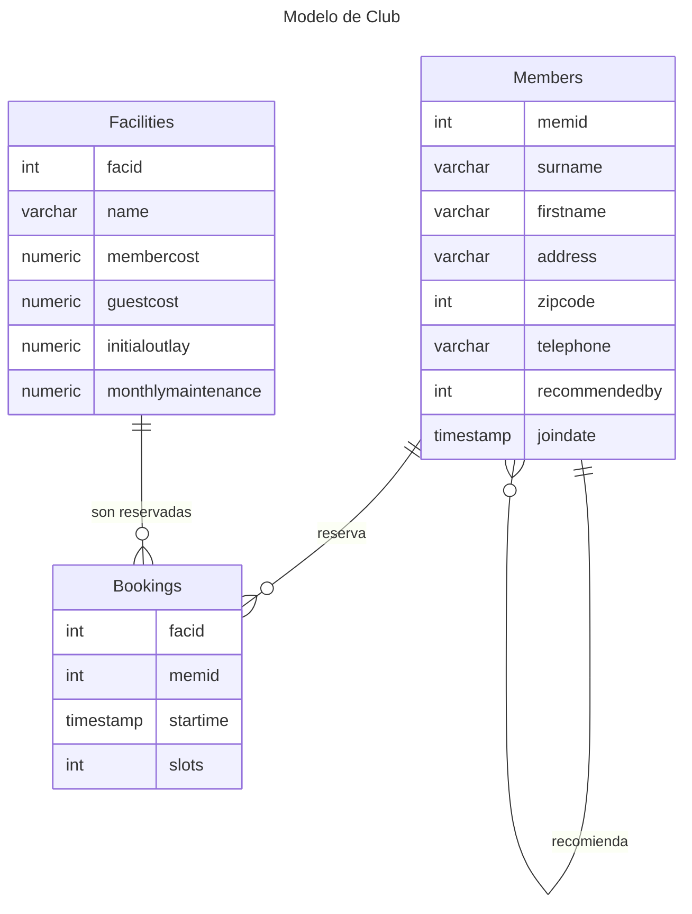

Del modelo se desprende que:

1. Un miembro puede recomendar a cero o muchos miembros
2. Un miembro puede hacer cero o muchas reservas
3. Las facilidades (servicios) pueden tener cero o muchas reservas

## Montaje de la Base de Datos

Puedes montar la base de datos usando el archivo provisto `clubdata.sql`, el cual posee las instrucciones para crear la base de datos, el esquema donde se montarán las tablas y la data con la cual se poblarán las tablas.

Para hacerlo tienes dos opciones en base a lo estudiadio en las clases: 

1. Consola, a través del CLI `psql`
2. Uso de gestor de bases de datos `DBeaver`

### Consola

Recuerda que para abrir un archivo desde el CLI `psql` es necesario que primero abras la terminal en la carpeta donde se encuentra el archivo `clubdata.sql`. 

Una vez abierta la terminal usarás el comando:

```bash
psql -U postgres # comando para ingresar a terminal postgres
```

Una vez dentro, necesitarás revisar si efectivamente está el archivo disponible en la carpeta donde se inició la terminal de postgres:

Para esto el comando depende del sistema operativo: 

```bash
# Usuarios de Linux, GitBash o MAC
\! ls 

# Usuarios de Windows.
\! dir
```

Estando seguros que el archivo se muestra como salida de alguno de los comandos anteriores, puedes ejecutar el comando: 

```bash
\i clubdata.sql
```

Con ésto deberías tener una base de datos exercises con un esquema cb, y las 3 tablas

### DBeaver (Justin Biever)

> [!IMPORTANT]
> Debes refrescar constantemente DBeaver para que puedas visualizar los cambios que vas realizando.


1. Para ejecutar el script, deberás crear a mano la base de datos:
    - 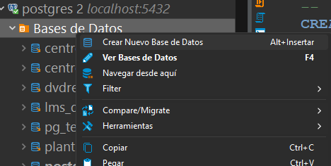
2. Y luego le asignarás el nombre `exercises`
    - 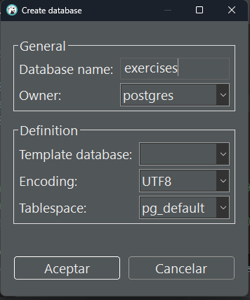
3. Abrirás un nuevo script, pegarás las líneas desde `CREATE SCHEMA cd;` en adelante y ejecutarás el Script
    - 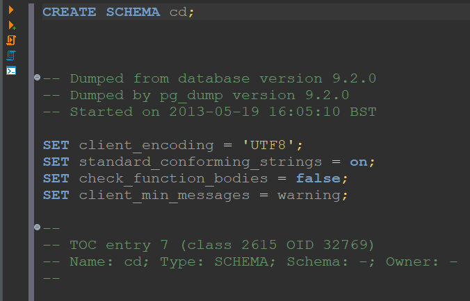

### Verificación

Para verificar que realmente se haya creado la data habiendo usado cualquiera de los métodos anteriores, desde DBeaver puedes mirar el esquema `cd` de la base de datos exercises:

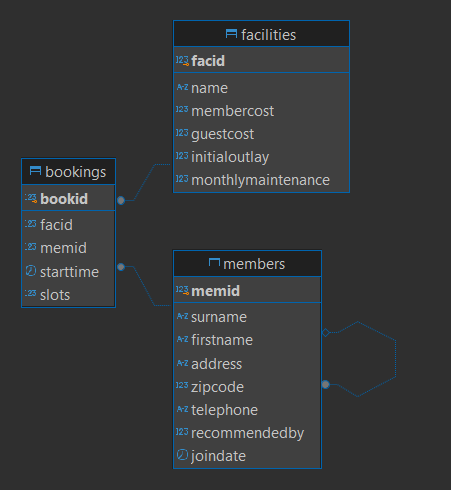

También, cuando estás en psql, puedes usar el comando

```sql
\dt cd.*
```

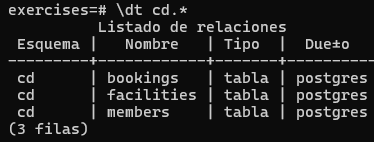

## Ejercicios

Una vez montada la data, podrás realizar los siguientes ejercicios para practicar:

> [!NOTE]
> Para cada ejercicio se entrega una captura de pantalla con los datos esperados
> 

### Consultas Básicas

1. Obtener toda la información de la tabla facilities:

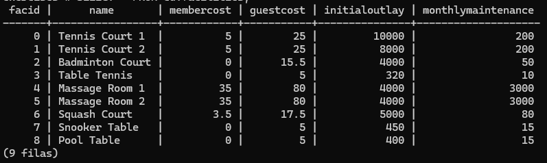

2. Obtener un listado sólo con el nombre del servicio (facilities) y costo asociado:

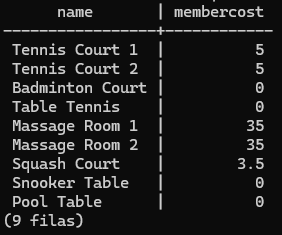

3. Obtener el listado de facilidades que tienen un costo asociado a los miembros:

> [!TIP]
> La clausula where te sirve para filtrar servicios con costos a los miembros membercost

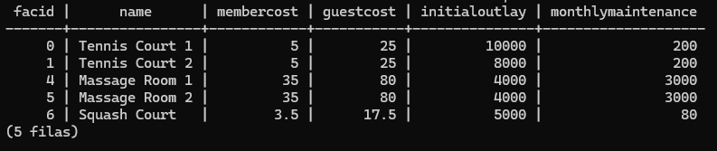

4. ¿Cómo se puede elaborar una lista de servicios que cobran una tarifa a los miembros y que dicha tarifa es inferior a 1/50 del coste de mantenimiento mensual? Devuelva la información sobre la `facid`, `name`, el `membercost` y el `monthlymaintenance` de los servicios en cuestión.

> [!TIP]
> Si conjugas la clausula `WHERE` con el operador lógico `AND` puedes crear más de una clausula a la vez

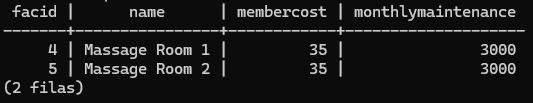

### Busqueda de texto

5. Elaborar una lista de servicios con la palabra "Tennis" en su nombre

> [!TIP]
> El operador `LIKE` junto con el string `%` te pueden ayudar

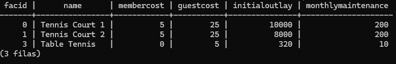

6. Obtener la información de los servicios con ID 1 y 5.

> [!TIP]
> El operador `OR` te puede ayudar

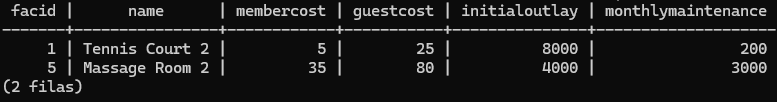

7. ¿Cómo se puede elaborar una lista de instalaciones, cada una de ellas etiquetada como "barata" o "cara" en función de si su coste de mantenimiento mensual es superior a 100 dólares? Devuelva el nombre y el mantenimiento mensual de las instalaciones en cuestión.

> [!TIP]
> La declaración `CASE` te puede ayudar en este caso

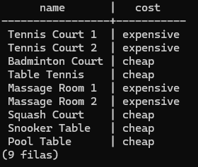

8. ¿Cómo se puede generar una lista de los miembros que se unieron después de principios de septiembre de 2012? Devuelva el número de identificación del miembro, el apellido, el nombre y la fecha de ingreso de los miembros en cuestión.

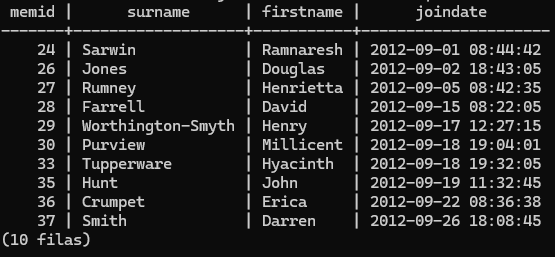

9. ¿Cómo se puede generar una lista ordenada de los primeros 10 apellidos (surname) de la tabla de miembros? La lista no debe contener duplicados.

> [!TIP]
> Recuerda que LIMIT te permite limitar la cantidad de resultados de una Query

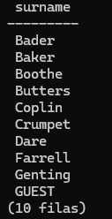

10. Por alguna razón, quieres una lista combinada de todos los apellidos y todos los nombres de las instalaciones. Sí, este es un ejemplo artificial 🦄. ¡Prepara esa lista!

> [!TIP]
> Puedes revisar la sentencia `UNION` de SQL

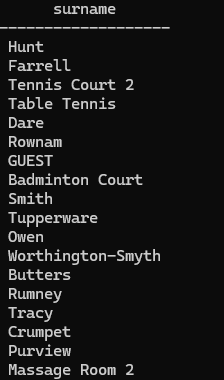

### Agregados

11. Te gustaría obtener la fecha de registro de tu último miembro. ¿Cómo puedes recuperar esta información?

> [!TIP]
> La función `MAX` de SQL te puede ayudar a obtener la informacion deseada

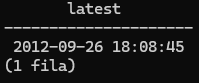

12. Quieres obtener el nombre y apellido del último miembro que se registró, no solo la fecha ¿Cómo puedes hacerlo?

> [!TIP]
> A veces puedes pedir que la clausula sea el resultado de una consulta anidada.
> ```sql
>   SELECT campo1, campo2 FROM tabla WHERE campo_filtro in (SELECT * FROM ....)
> ```

> [!tip]
> También puedes usar LIMIT y ORDER BY para obtener la información necesaria

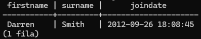

### Uniones y Subconsultas

Esta serie de ejercicios trata un aspecto fundamental de las bases de datos relacionales: Uniones
Estas uniones nos permiten relacionar multiples tablas para obtener respuestas.

13. ¿Cómo se puede producir una lista de las horas de inicio de las reservas realizadas por miembros llamados 'David Farrell'?

> [!TIP]
> La unión interna te ayudará a encontrar la solución a este problema

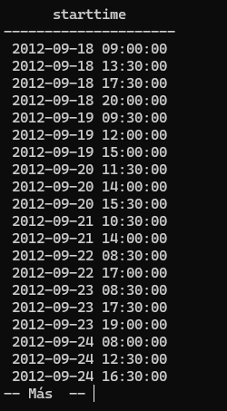

14. ¿Cómo se puede generar una lista de las horas de inicio de las reservas de canchas de tenis para la fecha '2012-09-21'? Devolver una lista de emparejamientos de hora de inicio y nombre de la instalación, ordenados por hora

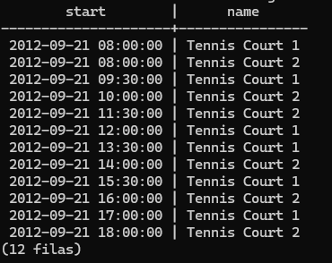

15. ¿Cómo se puede generar una lista de todos los miembros que han recomendado a otro miembro? Asegúrese de que no haya duplicados en la lista y de que los resultados estén ordenados por (apellido, nombre).

> [!TIP]
> Puedes hacer un `INNER JOIN` de la tabla members desde `memid` a `recommendedby`
> Tambien el `DISTINCT` será de utilidad

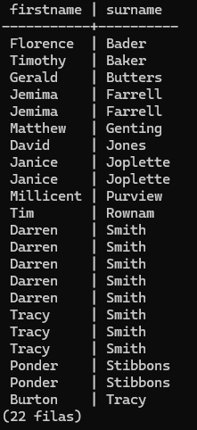

16. 

[1]: https://pgexercises.com/ "Manual interactivo en inglés"
[2]: https://marketplace.visualstudio.com/items?itemName=bierner.github-markdown-preview "Conjunto de extensiones para visualización de Markdown estilo GitHub"