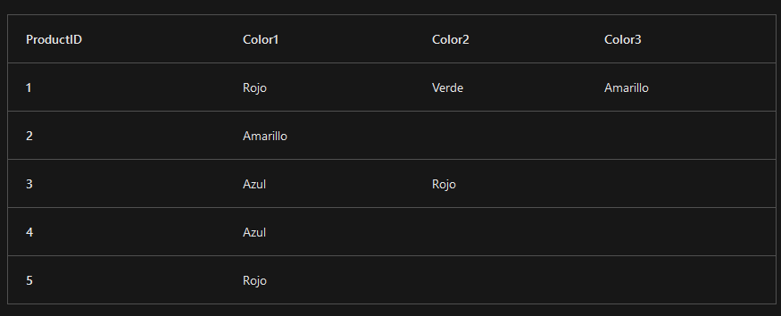

# Ejercicios Bases de Datos

## Transacción Bancaria

Deberás modelar y definir una base de datos que permita almacenarrr usuarios y sus cuentas bancarias
Luego deberás crear la transacción SQL que permita hacer una transferencia de fondos entre cuentras de usuarios

## Definición de tablas Local-Pub

Disponemos de la siguiente Base de Datos para gestionar la información de los pubs de una determinada provincia

Se pide escribir los comandos SQL que permitan la creación de las tablas anteriores
teniendo en cuenta las siguientes restricciones:
- Todos los valores son de tipo carácter excepto los campos FECHA_APERTURA
(fecha) , CANTIDAD, PRECIO y COD_LOCALIDAD (numéricos).
- Los únicos campos que no son obligatorios son los campos DOMICILIO.
- Los valores del campo horario sólo pueden ser HOR1, HOR2 y HOR3.
- No es posible crear EXISTENCIAS a precio 0.
- El campo función de la tabla PUB_EMPLEADO sólo puede tener los valores
CAMARERO, SEGURIDAD, LIMPIEZA.
- Se ha de mantener la integridad referencial entre las tablas.
- Las claves primarias vienen marcadas con el símbolo #
