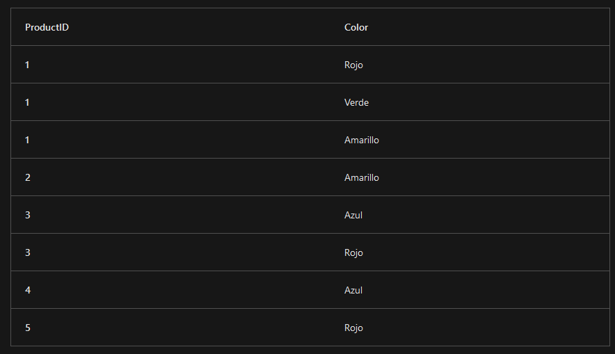
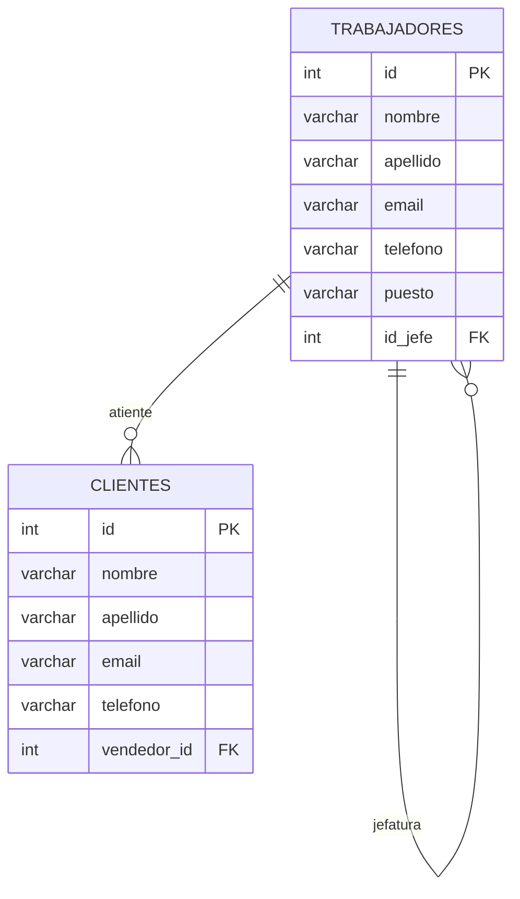
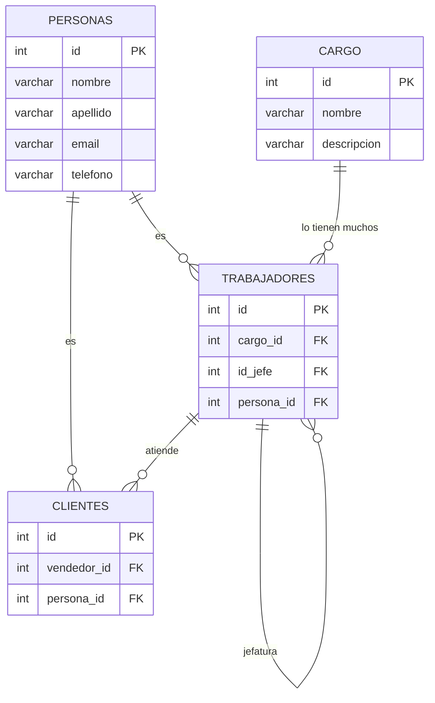

# Normalización de bases de datos

La normalización de bases de datos tiene como objetivo mejorar la eficientia del DBMS (Sistema gestor de bases de datos por sus siglas en inglés).

existen 5 formas normales, (o variaciones como la [forma normal de Codd][normalizacion-codd])

En la práctica, y por demas de rendimiento y arquitectura de los equipos, no suele usarse más allá de la tercera forma normal.

## 1FN - Primera Forma Normal

  -  Elimine los grupos repetidos de las tablas individuales.
  -  Cree una tabla independiente para cada conjunto de datos relacionados.
  -  Identifique cada conjunto de datos relacionados con una clave principal.

En la siguiente tabla de ejemplo `productColors` hay repetición de colores para un producto, 

---
**Tabla Product Info**
Está en primera forma normal
---

## 2FN - Segunda Forma Normal

- Si la tabla tiene clave (o clave compuesta) todos los atributos deberán depender de la clave
- Dicho de otra forma:
    - Cree tablas independientes para conjuntos de valores que se apliquen a varios registros.
    - Relacione estas tablas con una clave externa.

## 3FN - Tercera Forma Normal

- Todas las columnas sin clave dependen de forma no transitiva de la clave principal.

Dicho de otra forma: 

- Eliminar los campos que no dependen de la clave.

## Ejemplo previo trabajadores - Clientes

La tabla clientes y trabajadores tienen campos repetidos: nombre, apellido, email, teléfono.

---
Normalización del modelo anterior?
---

[normalizacion-codd]: https://es.wikipedia.org/wiki/Forma_normal_de_Boyce-Codd