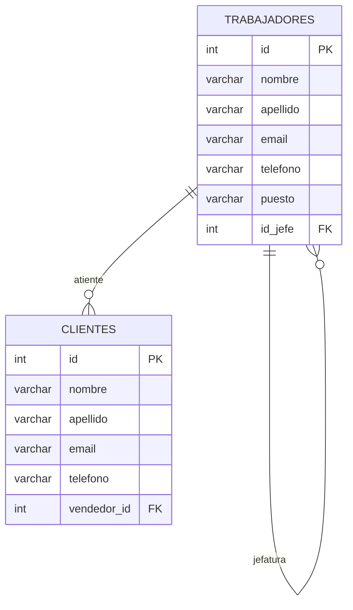
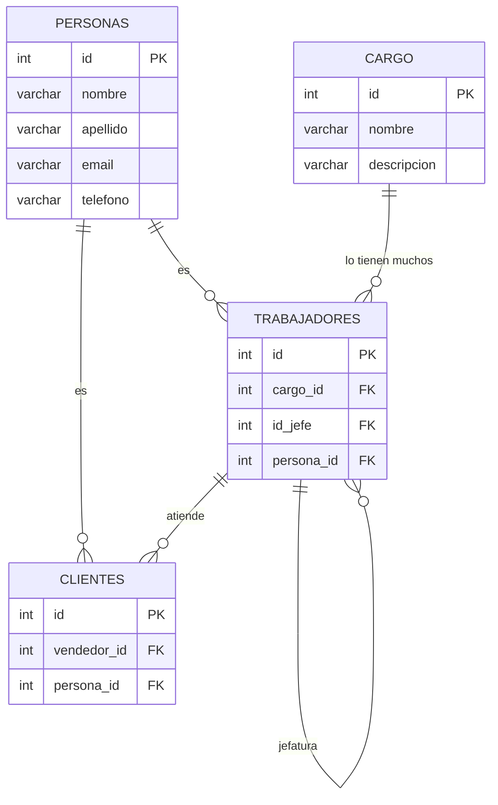

# Normalización de bases de datos

La normalización de bases de datos tiene como objetivo mejorar la eficientia del DBMS (Sistema gestor de bases de datos por sus siglas en inglés).

existen 5 formas normales, (o variaciones como la [forma normal de Codd][normalizacion-codd])

En la práctica, y por demas de rendimiento y arquitectura de los equipos, no suele usarse más allá de la tercera forma normal.

## 1FN - Primera Forma Normal

  -  Elimine los grupos repetidos de las tablas individuales.
  -  Cree una tabla independiente para cada conjunto de datos relacionados.
  -  Identifique cada conjunto de datos relacionados con una clave principal.


En la siguiente tabla de ejemplo `productColors` hay repetición de colores para un producto, 


---
**Tabla Product Info**
Está en primera forma normal
---


## 2FN - Segunda Forma Normal

- Si la tabla tiene clave (o clave compuesta) todos los atributos deberán depender de la clave
- Dicho de otra forma:
    - Cree tablas independientes para conjuntos de valores que se apliquen a varios registros.
    - Relacione estas tablas con una clave externa.

## 3FN - Tercera Forma Normal

- Todas las columnas sin clave dependen de forma no transitiva de la clave principal.

Dicho de otra forma: 

- Eliminar los campos que no dependen de la clave.


## Ejemplo previo trabajadores - Clientes

La tabla clientes y trabajadores tienen campos repetidos: nombre, apellido, email, teléfono.



---
Normalización del modelo anterior?
---



## Implementación a nivel BD

1.- Creación de Tablas

```sql
CREATE TABLE personas (
  id SERIAL PRIMARY KEY,
  nombre VARCHAR NOT NULL,
  apellido VARCHAR NOT NULL,
  email VARCHAR NOT NULL,
  telefono VARCHAR NOT NULL
);

CREATE TABLE trabajadores (
  id SERIAL PRIMARY KEY,
  persona_id INT,
  cargo_id INT,
  jefe_id INT
);

CREATE TABLE clientes (
  id SERIAL PRIMARY KEY,
  persona_id INT,
  vendedor_id INT
);

CREATE TABLE cargos (
  id SERIAL PRIMARY KEY,
  nombre VARCHAR NOT NULL,
  descripcion VARCHAR NOT NULL
);
```

2.- Creación de relaciones

```sql
-- Relación Trabajadores - Persona
ALTER TABLE trabajadores
ADD CONSTRAINT constraint_fk_persona
FOREIGN KEY (persona_id)
REFERENCES personas(id);

-- Clientes - Persona
ALTER TABLE clientes
ADD CONSTRAINT constraint_fk_persona
FOREIGN KEY (persona_id)
REFERENCES personas(id);

-- Relación jefaturas
ALTER TABLE trabajadores
ADD CONSTRAINT constraint_fk_trabajador
FOREIGN KEY (jefe_id)
REFERENCES trabajadores(id);

-- Relación cargos trabajadores
ALTER TABLE trabajadores
ADD CONSTRAINT constraint_fk_cargos
FOREIGN KEY (cargo_id)
REFERENCES cargos(id);

-- Relación trabajadores clientes
ALTER TABLE clientes
ADD CONSTRAINT constraint_fk_vendedor
FOREIGN KEY (vendedor_id)
REFERENCES trabajadores(id);
```

```sql
INSERT INTO cargos (nombre, descripcion) VALUES 
('Gerente General', 'Responsable de la dirección general y la estrategia de la empresa.'),
('Director de Marketing', 'Encargado de diseñar e implementar estrategias de marketing y comunicación.'),
('Jefe de Ventas', 'Lidera el equipo de ventas y desarrolla planes para alcanzar los objetivos comerciales.'),
('Analista Financiero', 'Realiza análisis financieros y elabora informes para apoyar la toma de decisiones.'),
('Desarrollador de Software', 'Desarrolla y mantiene aplicaciones y sistemas informáticos de la empresa.');
```

```sql
INSERT INTO personas (nombre, apellido, email, telefono) VALUES 
('Juan', 'Pérez', 'juan.perez@example.com', '123456789'),
('María', 'González', 'maria.gonzalez@example.com', '987654321'),
('Luis', 'Rodríguez', 'luis.rodriguez@example.com', '555555555'),
('Ana', 'Fernández', 'ana.fernandez@example.com', '111111111'),
('Carlos', 'Martínez', 'carlos.martinez@example.com', '222222222'),
('Laura', 'López', 'laura.lopez@example.com', '333333333'),
('José', 'García', 'jose.garcia@example.com', '444444444'),
('Elena', 'Sánchez', 'elena.sanchez@example.com', '666666666'),
('Miguel', 'Ramírez', 'miguel.ramirez@example.com', '777777777'),
('Sara', 'Torres', 'sara.torres@example.com', '888888888'),
('David', 'Flores', 'david.flores@example.com', '999999999'),
('Lucía', 'Hernández', 'lucia.hernandez@example.com', '101010101'),
('Javier', 'Jiménez', 'javier.jimenez@example.com', '202020202'),
('Paula', 'Moreno', 'paula.moreno@example.com', '303030303'),
('Andrés', 'Ruiz', 'andres.ruiz@example.com', '404040404'),
('Carmen', 'Alvarez', 'carmen.alvarez@example.com', '505050505'),
('Fernando', 'Ramírez', 'fernando.ramirez@example.com', '606060606'),
('Patricia', 'Santos', 'patricia.santos@example.com', '707070707'),
('Diego', 'Vega', 'diego.vega@example.com', '808080808'),
('Marta', 'Cruz', 'marta.cruz@example.com', '909090909'),
('Alberto', 'Ortiz', 'alberto.ortiz@example.com', '010101010'),
('Isabel', 'Ramos', 'isabel.ramos@example.com', '020202020'),
('Roberto', 'Castro', 'roberto.castro@example.com', '030303030'),
('Raquel', 'Silva', 'raquel.silva@example.com', '040404040'),
('Esteban', 'Molina', 'esteban.molina@example.com', '050505050');

```

```sql
INSERT INTO trabajadores (persona_id, cargo_id, jefe_id) VALUES 
(1, 1, NULL), -- Juan Pérez, Gerente General (sin jefe)
(2, 2, 1),   -- María González, Director de Marketing (jefe: Juan Pérez)
(3, 3, 1),   -- Luis Rodríguez, Jefe de Ventas (jefe: Juan Pérez)
(4, 4, 1),   -- Ana Fernández, Analista Financiero (jefe: Juan Pérez)
(5, 5, 1),   -- Carlos Martínez, Desarrollador de Software (jefe: Juan Pérez)
(6, 2, 2),   -- Laura López, Director de Marketing (jefe: María González)
(7, 3, 3),   -- José García, Jefe de Ventas (jefe: Luis Rodríguez)
(8, 4, 4),   -- Elena Sánchez, Analista Financiero (jefe: Ana Fernández)
(9, 5, 5),   -- Miguel Ramírez, Desarrollador de Software (jefe: Carlos Martínez)
(10, 2, 2),  -- Sara Torres, Director de Marketing (jefe: María González)
(11, 3, 3),  -- David Flores, Jefe de Ventas (jefe: Luis Rodríguez)
(12, 4, 4),  -- Lucía Hernández, Analista Financiero (jefe: Ana Fernández)
(13, 5, 5),  -- Javier Jiménez, Desarrollador de Software (jefe: Carlos Martínez)
(14, 2, 2),  -- Paula Moreno, Director de Marketing (jefe: María González)
(15, 3, 3),  -- Andrés Ruiz, Jefe de Ventas (jefe: Luis Rodríguez)
(16, 4, 4),  -- Carmen Alvarez, Analista Financiero (jefe: Ana Fernández)
(17, 5, 5),  -- Fernando Ramírez, Desarrollador de Software (jefe: Carlos Martínez)
(18, 2, 2),  -- Patricia Santos, Director de Marketing (jefe: María González)
(19, 3, 3),  -- Diego Vega, Jefe de Ventas (jefe: Luis Rodríguez)
(20, 4, 4);  -- Marta Cruz, Analista Financiero (jefe: Ana Fernández)
```

```sql
-- Insertar datos en la tabla clientes

INSERT INTO clientes (persona_id, vendedor_id)
VALUES
(21, 1),
(22, 1),
(23, 2),
(24, 2),
(25, 4);
```


[normalizacion-codd]: https://es.wikipedia.org/wiki/Forma_normal_de_Boyce-Codd