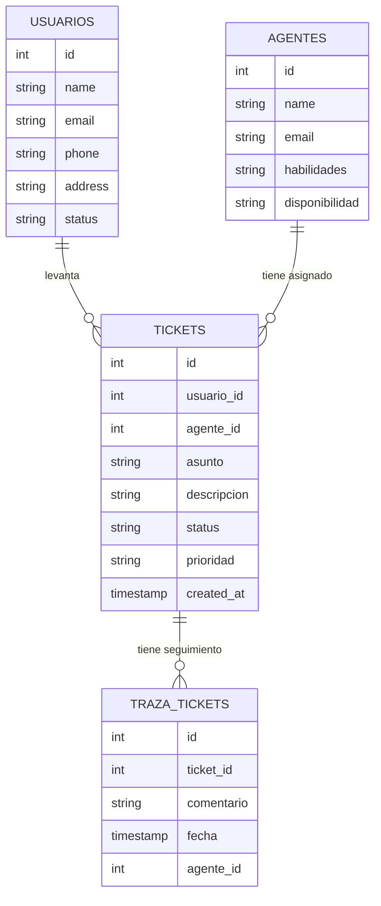

## Transacciones

Cuando hablamos de transacciones en SQL, nos referiremos a la realización de multiples operaciones CRUD que necesitan ejecutarse juntas para que tengan sentido como "unidad". 

Miremos el siguiente modelo simplificado de tickets: 



## Creación de tablas

### Drop if exists 

```sql
DROP TABLE IF EXISTS usarios;
DROP TABLE IF EXISTS agentes;
DROP TABLE IF EXISTS tickets;
DROP TABLE IF EXISTS traza_tickets;
```

### Tabla Usuarios

```sql
CREATE TABLE usuarios (
  id SERIAL PRIMARY KEY,
  nombre VARCHAR,
  email VARCHAR,
  telefono VARCHAR,
  direccion VARCHAR,
  status BOOLEAN DEFAULT TRUE
);
```

### Tabla Agentes

```sql
CREATE TABLE agentes (
  id SERIAL PRIMARY KEY,
  nombre VARCHAR,
  email VARCHAR,
  habilidades VARCHAR,
  disponibilidad BOOLEAN DEFAULT TRUE
);
```

### Tabla Tickets

```SQL

CREATE TABLE tickets (
  id SERIAL PRIMARY KEY,
  usuario_id INT,
  agente_id INT,
  asunto VARCHAR,
  descripcion VARCHAR,
  status VARCHAR DEFAULT 'Pendiente',
  prioridad VARCHAR,
  created_at VARCHAR
);
```

### Tabla traza_tickets

```sql
CREATE TABLE  traza_tickets (
  id SERIAL PRIMARY KEY,
  ticket_id INT,
  agente_id INT,
  comentario VARCHAR,
  fecha DATE
);
```


## Creación de relaciones y restricciones

### Tabla Tickets

Tiene llaves foráneas agente_id y usuario_id

```sql
ALTER TABLE tickets
ADD CONSTRAINT fk_usuario_id
FOREIGN KEY (usuario_id)
REFERENCES usuarios (id);
```

```sql
ALTER TABLE tickets
ADD CONSTRAINT fk_agente_id
FOREIGN KEY (agente_id)
REFERENCES agentes (id);
```

```sql
ALTER TABLE traza_tickets
ADD CONSTRAINT fk_ticket_id
FOREIGN KEY (ticket_id)
REFERENCES tickets (id);
```

```sql
ALTER TABLE traza_tickets
ADD CONSTRAINT fk_agente_id
FOREIGN KEY (agente_id)
REFERENCES agentes (id);
```

## Creación de registros

Insertamos usuarios en la tabla usuarios:

```sql
INSERT INTO usuarios (nombre, email, telefono, direccion) 
VALUES 
('Ana Gómez', 'ana.gomez@example.com', '555-1111', 'Av. Siempre Viva 101'),
('Luis Martínez', 'luis.martinez@example.com', '555-2222', 'Calle Luna 202'),
('Carlos Ramírez', 'carlos.ramirez@example.com', '555-3333', 'Av. Sol 303'),
('María Torres', 'maria.torres@example.com', '555-4444', 'Calle Estrella 404'),
('Jorge Díaz', 'jorge.diaz@example.com', '555-5555', 'Av. Río 505'),
('Sofía Pérez', 'sofia.perez@example.com', '555-6666', 'Calle Flor 606'),
('Andrés López', 'andres.lopez@example.com', '555-7777', 'Av. Montaña 707'),
('Lucía Fernández', 'lucia.fernandez@example.com', '555-8888', 'Calle Mar 808'),
('Roberto Castro', 'roberto.castro@example.com', '555-9999', 'Av. Cielo 909'),
('Paula Ríos', 'paula.rios@example.com', '555-0000', 'Calle Viento 100');
```

Inserción de datos en tabla agentes:

```sql
INSERT INTO agentes (nombre, email, habilidades)
VALUES
  ('Pedro Sánchez', 'pedro.sanchez@example.com', 'Negociación, Ventas'),
  ('Laura Herrera', 'laura.herrera@example.com', 'Atención al Cliente, Resolución de Problemas'),
  ('Miguel Ángel', 'miguel.angel@example.com', 'Comunicación, Liderazgo'),
  ('Clara Pérez', 'clara.perez@example.com', 'Resolución de Conflictos, Persuasión'),
  ('Raúl García', 'raul.garcia@example.com', 'Organización, Planificación'),
  ('Inés Martínez', 'ines.martinez@example.com', 'Trabajo en Equipo, Comunicación'),
  ('Diego López', 'diego.lopez@example.com', 'Ventas, Estrategia'),
  ('Sara Gómez', 'sara.gomez@example.com', 'Atención al Cliente, Negociación'),
  ('David Torres', 'david.torres@example.com', 'Resolución de Problemas, Gestión'),
  ('Patricia Ruiz', 'patricia.ruiz@example.com', 'Liderazgo, Estrategia');
```

### TRANSACCIONES

```sql
BEGIN TRANSACTION;

-- Nuevo Ticket
INSERT INTO tickets (usuario_id, agente_id, asunto, descripcion, prioridad, created_at)
VALUES
  (3, 5, 'No puedo ver yutú', 'No puedo ver yutú desde mi tablet', 'Media', CURRENT_TIMESTAMP);
-- Nueva Traza
INSERT INTO traza_tickets (ticket_id, agente_id, comentario, fecha)
VALUES
  (currval('tickets_id_seq'), 5, 'Se levanta ticket por usuario', CURRENT_TIMESTAMP);

COMMIT;
```


