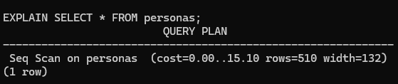
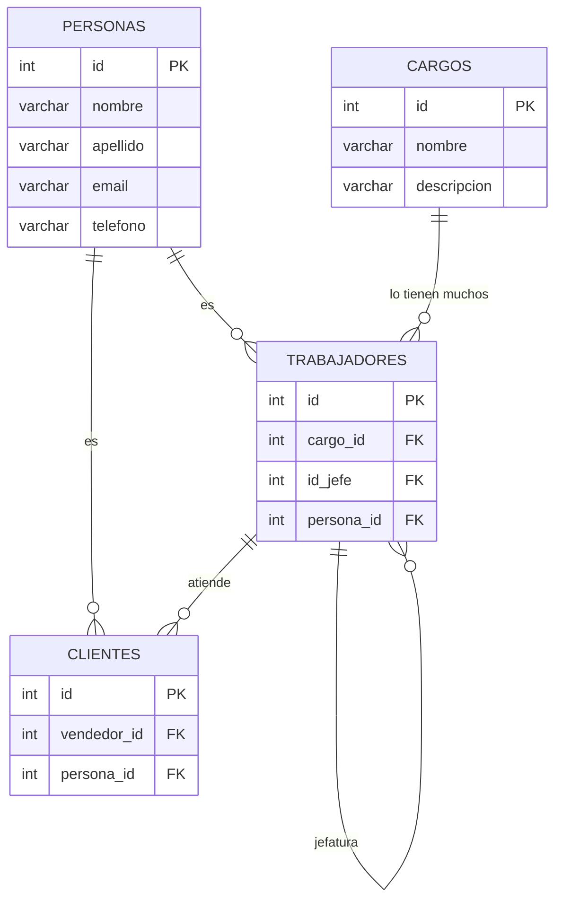
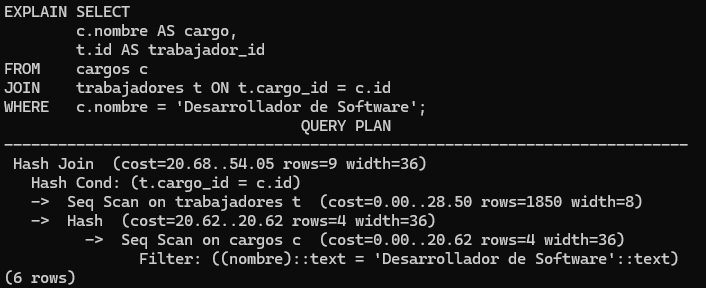
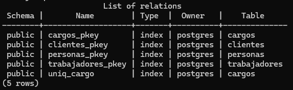

# Comando Explain y Optimización de Consultas

El servidor de bases de datos postgresql antes de ejecutar cada consulta, crea un plan de ejecución. 
Éste plan de ejecución puede verse con el comando `EXPLAIN` antes de cada consulta: 

```sql
EXPLAIN SELECT * FROM personas;
```



Este comando explicará cómo se realiza la busqueda en cada nodo.

Para el caso anterior, se puede visualizar que se realiza un escaneo secuencial en la tabla personas

## Estructura de un plan de ejecución (consulta)

El plan de ejecución es un árbol de planificación de nodos.

> [!NOTE]
> Los nodos en el nivel inferior del árbol son los ***Nodos de escaneo***, que retornan los registros en bruto de una tabla
> 
> p. ej: `scan on personas`

### Tipos de nodos

Existen diferentes tipos de nodos de escaneo, para diferentes métodos de accesos a las tablas: 

- ***sequential scans***: Escaneos secuenciales (uno a uno)

- ***escaneos de índices***: Escanéos de índices

- ***bitmap index scan***:escaneos bitmap de índices

### Fuentes distintas a las tablas: 

Existen fuentes distintas a las tablas (**non-table row sources**) como clausulas sobre `VALUES` y funciones que retornen conjuntos en `FROM` las cuales tienen sus propios tipos de nodos de escaneo.

### Nodos adicionales:

Si las consultas usan `JOINs`, agregados, ordenamientos u otro tipo de operaciones sobre las filas en bruto, entonces habrán nodos adicionales sobre los nodos de escaneo para realizar estas operaciones.

> [!NOTE]
> Existe más de una forma de realizar las operaciones, por lo que pueden aparecer distintos tipos de nodos.

### OUTPUT de EXPLAIN

La salida del comando explain tiene una línea por cada nodo en el árbol de planeación, mostrando el tipo básico de nodo más el costo estimado  que el planeador realiza para le ejecución de este nodo plan.

Líneas adicionales pueden aparecer, indentadas desde la línea resumen de los nodos para mostrar propiedades adicionales del nodo.

La primera línea (la línea de resumen del nodo superior) contiene el costo total estimado de ejecución del plan; es este número el que el planificador busca minimizar.

### Ejemplo

Un ejemplo trivial para analizar la salida del comando: 


Como no tiene clausula `WHERE` debe escanear todas las filas de la tabla, por lo que el planeador escoge un escaneo secuencial simple.

Los números de izquierda a derecha: 

- Costo estimado de inicio: Es el tiempo gastado antes de que la fase de salida pueda comenzar. Por ejemplo: el costo en de ordenado en un nodo de ordenación.

- Costo total estimado: Este está declarado asumiendo que el plan del nodo se ejecuta hasta completarse, es decir, todas las filas disponibles son recuperadas.
En la práctica, un nodo padre puede detener la ejecución antes de leer todas las filas disponibles (por ejemplo `LIMIT`)

- Numero estimado de filas que se retornarán en este nodo plan. Nuevamente se asume que se ejecutará hasta finalizar la recuperación de todas las filas.

- Ancho estimado de las filas devueltas por el nodo plan (en bytes)

> [!NOTE]
> Los costos están medidos en una escala arbitraria determinada por los parametros de [costo del planeador][costos-postgres] 

La práctica tradicional es medir los costos en unidades de páginas de disco recuperadas.

> [!IMPORTANT]
> Es importante notar que el costo de un nodo de nivel superior incluye los costos de todos los nodos hijos.

> [!IMPORTANT]
> También es importante notar que el costo sólo refleja cosas que le importan el planeador. Por ejemplo no considera el tiempo usado en convertir las filas a texto, o en transmitirlas al cliente.

## Ejemplo unión de tablas

Para este caso se usará la base de datos `trabajo_spa` con el siguiente modelo E-R



De momento no nos preocuparemos por definir llaves foráneas ni otras restricciones, queremos ver cómo es afectado el planificador de consultas al agregar índices.

### Creación de tablas

```sql
CREATE TABLE personas (
  id SERIAL PRIMARY KEY,
  nombre VARCHAR NOT NULL,
  apellido VARCHAR NOT NULL,
  email VARCHAR NOT NULL,
  telefono VARCHAR NOT NULL
);

CREATE TABLE trabajadores (
  id SERIAL PRIMARY KEY,
  persona_id INT,
  cargo_id INT,
  jefe_id INT
);

CREATE TABLE clientes (
  id SERIAL PRIMARY KEY,
  persona_id INT,
  vendedor_id INT
);

CREATE TABLE cargos (
  id SERIAL PRIMARY KEY,
  nombre VARCHAR NOT NULL,
  descripcion VARCHAR NOT NULL
);
```

### Poblado tablas

```sql
INSERT INTO cargos (nombre, descripcion) VALUES 
('Gerente General', 'Responsable de la dirección general y la estrategia de la empresa.'),
('Director de Marketing', 'Encargado de diseñar e implementar estrategias de marketing y comunicación.'),
('Jefe de Ventas', 'Lidera el equipo de ventas y desarrolla planes para alcanzar los objetivos comerciales.'),
('Analista Financiero', 'Realiza análisis financieros y elabora informes para apoyar la toma de decisiones.'),
('Desarrollador de Software', 'Desarrolla y mantiene aplicaciones y sistemas informáticos de la empresa.');

INSERT INTO personas (nombre, apellido, email, telefono) VALUES 
('Juan', 'Pérez', 'juan.perez@example.com', '123456789'),
('María', 'González', 'maria.gonzalez@example.com', '987654321'),
('Luis', 'Rodríguez', 'luis.rodriguez@example.com', '555555555'),
('Ana', 'Fernández', 'ana.fernandez@example.com', '111111111'),
('Carlos', 'Martínez', 'carlos.martinez@example.com', '222222222'),
('Laura', 'López', 'laura.lopez@example.com', '333333333'),
('José', 'García', 'jose.garcia@example.com', '444444444'),
('Elena', 'Sánchez', 'elena.sanchez@example.com', '666666666'),
('Miguel', 'Ramírez', 'miguel.ramirez@example.com', '777777777'),
('Sara', 'Torres', 'sara.torres@example.com', '888888888'),
('David', 'Flores', 'david.flores@example.com', '999999999'),
('Lucía', 'Hernández', 'lucia.hernandez@example.com', '101010101'),
('Javier', 'Jiménez', 'javier.jimenez@example.com', '202020202'),
('Paula', 'Moreno', 'paula.moreno@example.com', '303030303'),
('Andrés', 'Ruiz', 'andres.ruiz@example.com', '404040404'),
('Carmen', 'Alvarez', 'carmen.alvarez@example.com', '505050505'),
('Fernando', 'Ramírez', 'fernando.ramirez@example.com', '606060606'),
('Patricia', 'Santos', 'patricia.santos@example.com', '707070707'),
('Diego', 'Vega', 'diego.vega@example.com', '808080808'),
('Marta', 'Cruz', 'marta.cruz@example.com', '909090909'),
('Alberto', 'Ortiz', 'alberto.ortiz@example.com', '010101010'),
('Isabel', 'Ramos', 'isabel.ramos@example.com', '020202020'),
('Roberto', 'Castro', 'roberto.castro@example.com', '030303030'),
('Raquel', 'Silva', 'raquel.silva@example.com', '040404040'),
('Esteban', 'Molina', 'esteban.molina@example.com', '050505050');

INSERT INTO trabajadores (persona_id, cargo_id, jefe_id) VALUES 
(1, 1, NULL), -- Juan Pérez, Gerente General (sin jefe)
(2, 2, 1),   -- María González, Director de Marketing (jefe: Juan Pérez)
(3, 3, 1),   -- Luis Rodríguez, Jefe de Ventas (jefe: Juan Pérez)
(4, 4, 1),   -- Ana Fernández, Analista Financiero (jefe: Juan Pérez)
(5, 5, 1),   -- Carlos Martínez, Desarrollador de Software (jefe: Juan Pérez)
(6, 2, 2),   -- Laura López, Director de Marketing (jefe: María González)
(7, 3, 3),   -- José García, Jefe de Ventas (jefe: Luis Rodríguez)
(8, 4, 4),   -- Elena Sánchez, Analista Financiero (jefe: Ana Fernández)
(9, 5, 5),   -- Miguel Ramírez, Desarrollador de Software (jefe: Carlos Martínez)
(10, 2, 2),  -- Sara Torres, Director de Marketing (jefe: María González)
(11, 3, 3),  -- David Flores, Jefe de Ventas (jefe: Luis Rodríguez)
(12, 4, 4),  -- Lucía Hernández, Analista Financiero (jefe: Ana Fernández)
(13, 5, 5),  -- Javier Jiménez, Desarrollador de Software (jefe: Carlos Martínez)
(14, 2, 2),  -- Paula Moreno, Director de Marketing (jefe: María González)
(15, 3, 3),  -- Andrés Ruiz, Jefe de Ventas (jefe: Luis Rodríguez)
(16, 4, 4),  -- Carmen Alvarez, Analista Financiero (jefe: Ana Fernández)
(17, 5, 5),  -- Fernando Ramírez, Desarrollador de Software (jefe: Carlos Martínez)
(18, 2, 2),  -- Patricia Santos, Director de Marketing (jefe: María González)
(19, 3, 3),  -- Diego Vega, Jefe de Ventas (jefe: Luis Rodríguez)
(20, 4, 4);  -- Marta Cruz, Analista Financiero (jefe: Ana Fernández)

-- Insertar datos en la tabla clientes

INSERT INTO clientes (persona_id, vendedor_id)
VALUES
(21, 1),
(22, 1),
(23, 2),
(24, 2),
(25, 4);
```

### Plan de consulta

```sql
EXPLAIN SELECT
        c.nombre AS cargo,
        t.id AS trabajador_id
FROM    cargos c
JOIN    trabajadores t ON t.cargo_id = c.id
WHERE   c.nombre = 'Desarrollador de Software';
```



En éste caso, la búsqueda del nombre de cargo es secuencial.


## ¿Qué pasa si creamos índices en las consultas?

- ¿La restricción `Unique`, genera un índice? 

```sql
ALTER TABLE cargos
ADD CONSTRAINT uniq_cargo
UNIQUE(nombre);
```

el comando `\di` sirve para mostrar índices. en nuestra base de datos



en éste caso podemos ver la restricción `uniq_cargo` dentro del listado de índices.

## Costo de ejecución con índices


Como puedes ver, el costo previo de ejecución, junto con el plan de ejecución han bajado.

[costos-postgres]: https://www.postgresql.org/docs/current/runtime-config-query.html#RUNTIME-CONFIG-QUERY-CONSTANTS